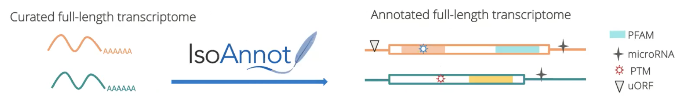
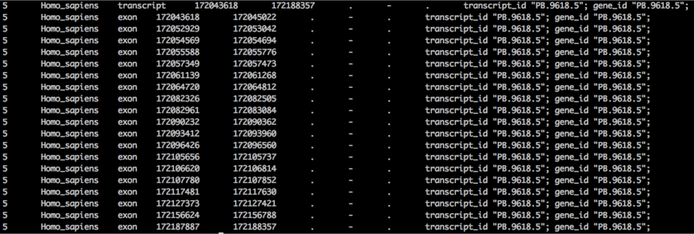
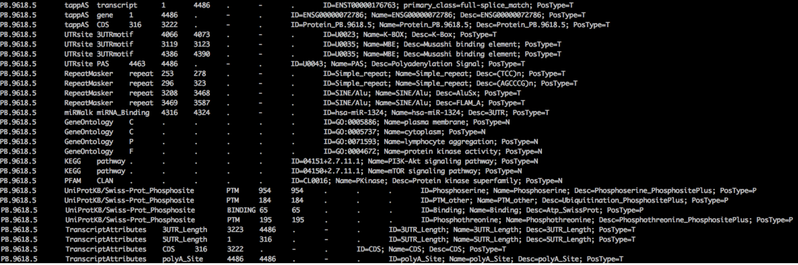
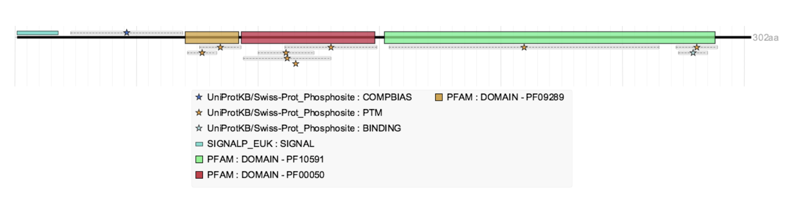

# IsoAnnot and TappAS Install

SQANTI, IsoAnnot and TappAS are all a part of the Functional Iso-Transcriptomics (FIT) toolset.

Questions that can be addressed using these tools are:

1. Which transcripts and functional annotations are present in my transcriptome?
2. How transcript expression changes between conditions?
3. What is the functional readout of these changes?


Tappas was published in 2020 in their [Genome Biology Paper](https://genomebiology.biomedcentral.com/articles/10.1186/s13059-020-02028-w)


## IsoAnnot and IsoAnnotLite

When working with long-read data, you typically obtain full-length transcripts with IDs that are specific to your experiment (ex. "PB.3796.2"), which are not supported by tappAS. IsoAnnot and IsoAnnot Lite are tools that:

* Assigns functional levels to transcript models and produces a TappAS compatable gff file.
* Labels are both for coding (ie PFAM domains) as well as for non-coding (ie microRNA binding sites) functions.
* Identify Nonsense-mediated mRNA decay (NMD) transcripts.



The softare is available on the [TappAS website](https://isoannot.tappas.org/)

#### IsoAnnot vs IsoAnnotLite

IsoAnnot is the main software that functionaly annotates a genome/transcriptome  and produces a GFF3 file that is compatable with TappAS. Its a large snakemake workflow (see [pdf](./IsoAnnot_snakemake.pdf)) that integrates information from public databases, but needs to be configured for each organism separately.


**Running IsoAnnot however is laborious and requires a fair level of computational skills. If you are interested in annotating your non-model species please, contact the Canesa lab for assistance in running the full pipeline on your species.**


In the meantime IsoAnnot Lite is available to map over functional annotation from precomputed gffs to your transcripts at the isoform level and produce a TappAS compatable gff3 file.

### IsoAnnot Lite precomputed GFF3 file


You'll need to use in SQANTI a reference genome and annotation of one of the [precomputed gffs](http://app.tappas.org/resources/downloads/gffs/) that the Canesa lab currently makes available:


* Arabidopsis thaliana Ensembl v34
* Drosophila melanogaster Ensembl v90
* Homo sapiens GRCh38 Ensembl v86
* Homo sapiens GRCh38 RefSeq v78
* Mus musculus GRCm38 Ensembl v86
* Mus musculus GRCm38 RefSeq v78
* Zea mays Ensembl v34


IsoAnnot Lite takes the output produced by SQANTI (PacBio_corrected.gtf PacBio_classification.txt PacBio_junctions.txt), and optionally precomputed IsoAnnot gff3 file and produces a TappAS compatable gff for your isoforms.

### Running IsoAnnot IsoAnnot Lite

There are two ways to produce a TappAS compatable gff,

1. The easiest way is to run SQANTI with IsoAnnot options (**preferred**)

  ```
  conda deactivate
  module load sqanti3/4.1
  source activate sqanti3-4.1

  sqanti3_qc.py --help
  ```


  --isoAnnotLite        Run isoAnnot Lite to output a tappAS-compatible gff3 file
  --gff3 GFF3           Precomputed tappAS species specific GFF3 file. It will serve as reference to transfer functional attributes


2. Second if you've already run SQANTI you can run the IsoAnnot Lite python script on the output directly.

  Download the IsoAnnot python script from [here](https://isoannot.tappas.org/isoannot-lite/)


  The command then _looks_ like the following:

  ```
  python IsoAnnotLite.py my_corrected.gtf my_classification.txt my_junctions.txt -gff3 tappAS.gff3 -novel -o output_name_newGFF3 -stdout output_name_summaryResults
  ```

  Argument -novel allows IsoAnnotLite to compare every transcript against all the transcript that belong to the same gene. This procedure takes a little longer but gets better results

### Excercises

For the dataset we ran SQANTI on:

  1. Download the appropriate TappAS gff file (**Key: reference annotation file and the TappAS GFF3 annotation file must use the same transcript IDs**).
  2. Download the IsoAnnotLite python script.
  3. Run IsoAnnot on the previously produced SQANTI results.
  4. Run SQANTI again this time using the IsoAnnot option.


### IsoAnnot results

Example: PB.9618.5
• Information in GTF after running SQANTI3



Example: PB.9618.5
• Information in GFF3 after running SQANTI3+isoAnnotLite



Example: PB.9618.5
• Information in GFF3 after running SQANTI3+isoAnnotLite loaded into tappAS


