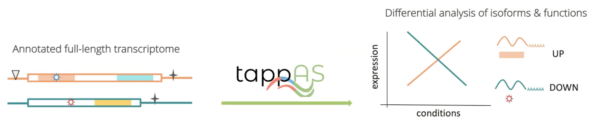

# tappAS Installation

tappAS ia a Java GUI application that can:

1. Analyze diversity of isoform annotations.
2. Calculate differential isoform usage.
3. Find pathways and functional domains affected by splicing.
4. Evaluate differences at UTRs.



The softare is available on the [TappAS website](https://app.tappas.org/)

The github repository is [here](https://github.com/ConesaLab/tappAS)


## Installing tappAS on your computer

tappAS is a Java application and requires few prerequisites.

* [Java version 8](https://www.java.com/en/download/manual.jsp) (**NOT** version 9)
* [R Statistical Environment](https://www.r-project.org/)
* An a number of R packages.
  - When you run tappAS for the first time, it will check and install any missing R packages needed, _this may take a while to complete_. You can also install some of these ahead of time, though this script appears outdated as some packages have been deprecated recently.
  - Start R
    ```
    source("http://app.tappAS.org/resources/downloads/tappAS_packages.R")
    ```

  I did both, I started with sourcing the R script, got _some_ things installed and then let the app finish up.


Finally,
* Download [example data](https://app.tappas.org/resources/downloads/tutorials/tappAS_projectData.zip)


Additional Tutorials for tappAS can be found [here](https://app.tappas.org/tutorials/)
