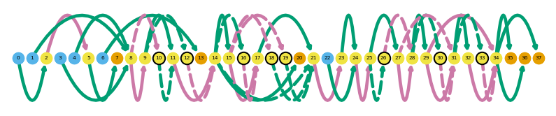

## Data processing with Swan
The following section was already run so you don't have to wait for results, but you're welcome to give it a try!


```python
# data download
!wget http://crick.bio.uci.edu/freese/210830_ucd_workshop/data.tgz
!tar -xf data.tgz
```


```python
import swan_vis as swan
```


```python
# construct SwanGraph
annot_gtf = 'ref/gencode.vM21.annotation.gtf'
data_gtf = 'data/all_talon_observedOnly.gtf'
ab_file = 'data/all_talon_abundance_filtered.tsv'
meta = 'data/metadata.tsv'
```


```python
sg = swan.SwanGraph()
sg.add_annotation(annot_gtf)
sg.add_transcriptome(data_gtf)
sg.add_abundance(ab_file)
sg.add_metadata(meta)
```


```python
sg.save_graph('swan')
```

    Saving graph as swan.p


```python
# compare 0 and 72 hr time point
obs_col = 'time_point'
obs_conditions = ['0hr', '72hr']
_ = sg.de_gene_test(obs_col, obs_conditions=obs_conditions)
_ = sg.de_transcript_test(obs_col, obs_conditions=obs_conditions)
_ = sg.die_gene_test(obs_col, obs_conditions=obs_conditions)
test = sg.die_gene_test(kind='tss', obs_col=obs_col, obs_conditions=obs_conditions)
test = sg.die_gene_test(kind='tes', obs_col=obs_col, obs_conditions=obs_conditions)
```


```python
# find novel exon-skipping and intron retention events
_ = sg.find_es_genes()
_ = sg.find_ir_genes()
```


```python
# save graph again so we have access to all the results
sg.save_graph('swan')
```

    Saving graph as swan.p


## Figures generated using bulk C2C12 data for the presentation


```python
import swan_vis as swan
import scanpy as sc
```


```python
sg = swan.read('swan.p')
```

    Read in graph from swan.p


```python
sg.plot_graph('Tfdp1', indicate_novel=True)
```


```python
sg.plot_transcript_path('TALONT000169332', indicate_novel=True)
```


```python
sg.gen_report('Chp1',
              'figures/chp1',
              metadata_cols=['time_point'],
              cmap='viridis',
              transcript_name=True,
              novelty=True,
              indicate_novel=True)

sg.gen_report('Chp1',
              'figures/chp1',
              metadata_cols=['time_point'],
              cmap='magma',
              transcript_name=True,
              novelty=True,
              layer='pi',
              browser=True,
              display_numbers=True)

sg.adata.var = sg.adata.var.merge(sg.t_df[['gname', 'tname']], left_index=True, right_index=True, how='left')
var_names = sg.adata.var.loc[sg.adata.var.gname == 'Chp1', 'tname'].tolist()
sc.pl.matrixplot(sg.adata, var_names,
                 gene_symbols='tname',
                 groupby='time_point', layer='pi',
                 cmap='magma', swap_axes=True)
```

    ... storing 'cell_line' as categorical
    ... storing 'time_point' as categorical
    ... storing 'gname' as categorical


```python
sg.gen_report('Tnnt2',
              'figures/tnnt2',
              metadata_cols=['time_point'],
              cmap='viridis',
              transcript_name=True,
              novelty=True,
              indicate_novel=True)

sg.gen_report('Tnnt2',
              'figures/tnnt2',
              metadata_cols=['time_point'],
              cmap='magma',
              transcript_name=True,
              novelty=True,
              layer='pi',
              browser=True,
              display_numbers=True)

var_names = sg.tss_adata.var.loc[sg.tss_adata.var.gname == 'Tnnt2', 'tss_name'].tolist()
sc.pl.matrixplot(sg.tss_adata, var_names,
                 gene_symbols='tss_name',
                 groupby='time_point', layer='pi',
                 cmap='magma', swap_axes=True)
```

    ... storing 'cell_line' as categorical
    ... storing 'time_point' as categorical
    ... storing 'gid' as categorical
    ... storing 'gname' as categorical
    ... storing 'tss_name' as categorical


```python
sg.gen_report('Tpm1',
              'figures/tpm1',
              metadata_cols=['time_point'],
              groupby='time_point',
              cmap='viridis',
              transcript_name=True,
              novelty=True,
              indicate_novel=True)

sg.gen_report('Tpm1',
              'figures/tpm1',
              metadata_cols=['time_point'],
              groupby='time_point',
              cmap='viridis',
              transcript_name=True,
              novelty=True,
              indicate_novel=True)

var_names = sg.tes_adata.var.loc[sg.tes_adata.var.gname == 'Tpm1', 'tes_name'].tolist()
sc.pl.matrixplot(sg.tes_adata, var_names,
                 gene_symbols='tes_name',
                 groupby='time_point', layer='pi',
                 cmap='magma')
```


## Your turn!

### Install Swan

Run the block below to install from GitHub directly


```python
!git clone git@github.com:mortazavilab/swan_vis.git
!cd swan_vis
!pip install .
```

Alternatively, install from PyPi (this will be exactly the same!)


```python
!pip install swan_vis
```

Now we'll take a look at some of the results from Swan and make some cool plots. Please check out the [documentation](https://freese.gitbook.io/swan/) to get a better idea of the stuff you can do!


```python
# download the SwanGraph
!wget http://crick.bio.uci.edu/freese/210830_ucd_workshop/swan.p

# create a figures directory because there will be a lot of output figures!
!mkdir figures
```


```python
# import swan
import swan_vis as swan
```


```python
# load the SwanGraph
sg = swan.read('swan.p')
```

    Read in graph from swan.p


### What genes contain novel exon skipping events?

We can query the SwanGraph object for a table of exon skipping events. Here, we'll do just that as well as visualize the exon skipping events in a few genes.


```python
# get table of exon skipping events
es = sg.adata.uns['es']

# add gene names, which I should make automatic in a future update!
gnames = sg.t_df[['gid', 'gname']]
print(len(es.index))
es = es.merge(gnames, on='gid', how='left')
es = es.drop_duplicates()
es.head()
```

    1303


<div>
<table border="1" class="dataframe">
  <thead>
    <tr style="text-align: right;">
      <th></th>
      <th>gid</th>
      <th>tid</th>
      <th>egde_id</th>
      <th>gname</th>
    </tr>
  </thead>
  <tbody>
    <tr>
      <th>0</th>
      <td>SIRV3.1</td>
      <td>SIRV3.1-SIRV301</td>
      <td>741285</td>
      <td>SIRV3.1</td>
    </tr>
    <tr>
      <th>7</th>
      <td>SIRV3.1</td>
      <td>SIRV3.1-SIRV303</td>
      <td>741285</td>
      <td>SIRV3.1</td>
    </tr>
    <tr>
      <th>14</th>
      <td>SIRV5.1</td>
      <td>SIRV5.1-SIRV505</td>
      <td>741375</td>
      <td>SIRV5.1</td>
    </tr>
    <tr>
      <th>24</th>
      <td>SIRV5.1</td>
      <td>SIRV5.1-SIRV510</td>
      <td>741375</td>
      <td>SIRV5.1</td>
    </tr>
    <tr>
      <th>34</th>
      <td>SIRV6.1</td>
      <td>SIRV6.1-SIRV601</td>
      <td>741415</td>
      <td>SIRV6.1</td>
    </tr>
  </tbody>
</table>
</div>


```python
# unique genes
es_genes = es.gname.unique().tolist()
print(len(es_genes))
es_genes[5:10]
```

    518


    ['Col3a1', 'Bzw1', 'Creb1', 'Ttll4', 'Stk16']


Let's plot a few of these genes that have exon skipping events.


```python
es.loc[es.gname == 'Srsf4'] # Srsf4 is a splicing factor!
```


<div>
<table border="1" class="dataframe">
  <thead>
    <tr style="text-align: right;">
      <th></th>
      <th>gid</th>
      <th>tid</th>
      <th>egde_id</th>
      <th>gname</th>
    </tr>
  </thead>
  <tbody>
    <tr>
      <th>9450</th>
      <td>ENSMUSG00000028911.16</td>
      <td>TALONT000495077</td>
      <td>732856</td>
      <td>Srsf4</td>
    </tr>
  </tbody>
</table>
</div>


```python
sg.plot_graph('Srsf4', indicate_novel=True)
```


```python
sg.plot_transcript_path('TALONT000495077', indicate_novel=True)
```


```python
es.loc[es.gname == 'Tnnt3']
```


<div>

<table border="1" class="dataframe">
  <thead>
    <tr style="text-align: right;">
      <th></th>
      <th>gid</th>
      <th>tid</th>
      <th>egde_id</th>
      <th>gname</th>
    </tr>
  </thead>
  <tbody>
    <tr>
      <th>12557</th>
      <td>ENSMUSG00000061723.18</td>
      <td>TALONT000560315</td>
      <td>734894</td>
      <td>Tnnt3</td>
    </tr>
  </tbody>
</table>
</div>


```python
sg.plot_graph('Tnnt3', indicate_novel=True)
```


```python
sg.plot_transcript_path('TALONT000560315', indicate_novel=True)
```


```python
es.loc[es.gname == 'Vim']
```


<div>

<table border="1" class="dataframe">
  <thead>
    <tr style="text-align: right;">
      <th></th>
      <th>gid</th>
      <th>tid</th>
      <th>egde_id</th>
      <th>gname</th>
    </tr>
  </thead>
  <tbody>
    <tr>
      <th>7589</th>
      <td>ENSMUSG00000026728.9</td>
      <td>TALONT000162980</td>
      <td>731211</td>
      <td>Vim</td>
    </tr>
  </tbody>
</table>
</div>


```python
sg.plot_graph('Vim', indicate_novel=True)
```





```python
sg.plot_transcript_path('TALONT000162980', indicate_novel=True)
```


### What genes contain novel intron retention events?

We'll do the same thing for genes with novel intron retention events. We'll pull them from the SwanGraph and plot a few examples.


```python
# get table of intron retention events
ir = sg.adata.uns['ir']

# add gene names, which I should make automatic in a future update!
gnames = sg.t_df[['gid', 'gname']]
print(len(ir.index))
ir = ir.merge(gnames, on='gid', how='left')
ir = ir.drop_duplicates()
ir.head()
```

    215


<div>

<table border="1" class="dataframe">
  <thead>
    <tr style="text-align: right;">
      <th></th>
      <th>gid</th>
      <th>tid</th>
      <th>egde_id</th>
      <th>gname</th>
    </tr>
  </thead>
  <tbody>
    <tr>
      <th>0</th>
      <td>SIRV2.2</td>
      <td>SIRV2.2-SIRV206</td>
      <td>741283</td>
      <td>SIRV2.2</td>
    </tr>
    <tr>
      <th>1</th>
      <td>SIRV3.1</td>
      <td>SIRV3.1-SIRV302</td>
      <td>741299</td>
      <td>SIRV3.1</td>
    </tr>
    <tr>
      <th>8</th>
      <td>SIRV3.1</td>
      <td>SIRV3.1-SIRV303</td>
      <td>741299</td>
      <td>SIRV3.1</td>
    </tr>
    <tr>
      <th>15</th>
      <td>SIRV5.1</td>
      <td>SIRV5.1-SIRV506</td>
      <td>741388</td>
      <td>SIRV5.1</td>
    </tr>
    <tr>
      <th>25</th>
      <td>SIRV5.1</td>
      <td>SIRV5.1-SIRV511</td>
      <td>741388</td>
      <td>SIRV5.1</td>
    </tr>
  </tbody>
</table>
</div>


```python
# unique genes
ir_genes = ir.gname.unique().tolist()
print(len(ir_genes))
ir_genes[4]
```

    117


    'Plekhb2'


```python
sg.plot_graph('Plekhb2', indicate_novel=True)
```


```python
ir.loc[ir.gname == 'Plekhb2']
```


<div>

<table border="1" class="dataframe">
  <thead>
    <tr style="text-align: right;">
      <th></th>
      <th>gid</th>
      <th>tid</th>
      <th>egde_id</th>
      <th>gname</th>
    </tr>
  </thead>
  <tbody>
    <tr>
      <th>189</th>
      <td>ENSMUSG00000001436.15</td>
      <td>TALONT000218169</td>
      <td>736549</td>
      <td>Slc19a1</td>
    </tr>
    <tr>
      <th>204</th>
      <td>ENSMUSG00000001436.15</td>
      <td>TALONT000218202</td>
      <td>736549</td>
      <td>Slc19a1</td>
    </tr>
  </tbody>
</table>
</div>


```python
sg.plot_transcript_path('TALONT000218169', indicate_novel=True)
```


```python
sg.plot_transcript_path('TALONT000218169', browser=True)
```


```python
ir_genes[10:15]
```


    ['Ptbp1', 'Oaz1', 'Apba3', 'TALONG000074151', 'Txnrd1']


```python
sg.plot_graph('Oaz1', indicate_novel=True)
```


```python
ir.loc[ir.gname == 'Oaz1']
```


<div>

<table border="1" class="dataframe">
  <thead>
    <tr style="text-align: right;">
      <th></th>
      <th>gid</th>
      <th>tid</th>
      <th>egde_id</th>
      <th>gname</th>
    </tr>
  </thead>
  <tbody>
    <tr>
      <th>317</th>
      <td>ENSMUSG00000035242.15</td>
      <td>TALONT000269069</td>
      <td>736630</td>
      <td>Oaz1</td>
    </tr>
  </tbody>
</table>
</div>


```python
sg.plot_transcript_path('TALONT000269069', indicate_novel=True)
```


### What genes are differentially-expressed between myotubes and myoblasts?

Now we'll take a look at some of the results of statistical tests run between the myoblast and myotube conditions. We can access the differentially-expressed genes in the SwanGraph and provide q value and log fold change thresholds. Here we'll use q < 0.05 and log2fc > 1.


```python
obs_col = 'time_point'
obs_conditions = ['0hr', '72hr']
```


```python
de_genes = sg.get_de_genes(obs_col, obs_conditions=obs_conditions,
                           q=0.05, log2fc=1)
```


```python
de_genes.head()
```


<div>

<table border="1" class="dataframe">
  <thead>
    <tr style="text-align: right;">
      <th></th>
      <th>gid</th>
      <th>pval</th>
      <th>qval</th>
      <th>log2fc</th>
      <th>mean</th>
      <th>zero_mean</th>
      <th>grad</th>
      <th>coef_mle</th>
      <th>coef_sd</th>
      <th>ll</th>
      <th>gname</th>
    </tr>
  </thead>
  <tbody>
    <tr>
      <th>19866</th>
      <td>ENSMUSG00000070733.13</td>
      <td>0.0</td>
      <td>0.0</td>
      <td>283.913085</td>
      <td>0.561909</td>
      <td>False</td>
      <td>0.500002</td>
      <td>283.913085</td>
      <td>2.222759e-162</td>
      <td>-16.217098</td>
      <td>Fryl</td>
    </tr>
    <tr>
      <th>18848</th>
      <td>ENSMUSG00000065852.1</td>
      <td>0.0</td>
      <td>0.0</td>
      <td>283.913085</td>
      <td>0.407021</td>
      <td>False</td>
      <td>0.500000</td>
      <td>283.913085</td>
      <td>2.222759e-162</td>
      <td>-15.435992</td>
      <td>Gm22353</td>
    </tr>
    <tr>
      <th>18852</th>
      <td>ENSMUSG00000065862.1</td>
      <td>0.0</td>
      <td>0.0</td>
      <td>283.913085</td>
      <td>0.407021</td>
      <td>False</td>
      <td>0.500000</td>
      <td>283.913085</td>
      <td>2.222759e-162</td>
      <td>-15.435992</td>
      <td>Gm24029</td>
    </tr>
    <tr>
      <th>19949</th>
      <td>ENSMUSG00000071042.12</td>
      <td>0.0</td>
      <td>0.0</td>
      <td>283.913085</td>
      <td>0.203510</td>
      <td>False</td>
      <td>0.409290</td>
      <td>283.913085</td>
      <td>2.222759e-162</td>
      <td>-11.215066</td>
      <td>Rasgrp3</td>
    </tr>
    <tr>
      <th>7466</th>
      <td>ENSMUSG00000029699.13</td>
      <td>0.0</td>
      <td>0.0</td>
      <td>283.913085</td>
      <td>0.578117</td>
      <td>False</td>
      <td>1.000000</td>
      <td>283.913085</td>
      <td>2.222759e-162</td>
      <td>-28.840319</td>
      <td>Ssc4d</td>
    </tr>
  </tbody>
</table>
</div>


```python
# look for myo-related genes (which are often implicated in the myogenic process)
de_genes.loc[de_genes.gname.str.contains('Myo')].head()
```


<div>

<table border="1" class="dataframe">
  <thead>
    <tr style="text-align: right;">
      <th></th>
      <th>gid</th>
      <th>pval</th>
      <th>qval</th>
      <th>log2fc</th>
      <th>mean</th>
      <th>zero_mean</th>
      <th>grad</th>
      <th>coef_mle</th>
      <th>coef_sd</th>
      <th>ll</th>
      <th>gname</th>
    </tr>
  </thead>
  <tbody>
    <tr>
      <th>19415</th>
      <td>ENSMUSG00000068697.7</td>
      <td>0.0</td>
      <td>0.0</td>
      <td>283.913085</td>
      <td>4.689763</td>
      <td>False</td>
      <td>1.000000</td>
      <td>283.913085</td>
      <td>2.222759e-162</td>
      <td>-38.567663</td>
      <td>Myoz1</td>
    </tr>
    <tr>
      <th>6503</th>
      <td>ENSMUSG00000028116.13</td>
      <td>0.0</td>
      <td>0.0</td>
      <td>283.913085</td>
      <td>28.415941</td>
      <td>False</td>
      <td>0.999999</td>
      <td>283.913085</td>
      <td>2.222759e-162</td>
      <td>-45.865588</td>
      <td>Myoz2</td>
    </tr>
    <tr>
      <th>20253</th>
      <td>ENSMUSG00000072720.9</td>
      <td>0.0</td>
      <td>0.0</td>
      <td>283.913085</td>
      <td>5.471390</td>
      <td>False</td>
      <td>1.000000</td>
      <td>283.913085</td>
      <td>2.222759e-162</td>
      <td>-39.200583</td>
      <td>Myo18b</td>
    </tr>
    <tr>
      <th>10601</th>
      <td>ENSMUSG00000037139.15</td>
      <td>0.0</td>
      <td>0.0</td>
      <td>283.913085</td>
      <td>16.414171</td>
      <td>False</td>
      <td>0.999999</td>
      <td>283.913085</td>
      <td>2.222759e-162</td>
      <td>-43.658559</td>
      <td>Myom3</td>
    </tr>
    <tr>
      <th>8369</th>
      <td>ENSMUSG00000031461.4</td>
      <td>0.0</td>
      <td>0.0</td>
      <td>283.913085</td>
      <td>351.204727</td>
      <td>False</td>
      <td>0.999999</td>
      <td>283.913085</td>
      <td>2.222759e-162</td>
      <td>-55.932105</td>
      <td>Myom2</td>
    </tr>
  </tbody>
</table>
</div>


```python
# number of differentially-expressed genes
len(de_genes.index)
```


    5392


### What transcripts are differentially-expressed between myoblasts and myotubes?

Now we'll take a look at transcripts that are differentially-expressed between the time points. These can be accessed much in the same way that the differentially-expressed genes can be. We'll also make a gene report showing the differentially-expressed transcript isoforms in one gene, _Myo6_.


```python
# results from differential transcript expression test
de_transcripts = sg.get_de_transcripts(obs_col, obs_conditions=obs_conditions,
                           q=0.05, log2fc=1)
```


```python
de_transcripts.head()
```


<div>

<table border="1" class="dataframe">
  <thead>
    <tr style="text-align: right;">
      <th></th>
      <th>tid</th>
      <th>pval</th>
      <th>qval</th>
      <th>log2fc</th>
      <th>mean</th>
      <th>zero_mean</th>
      <th>grad</th>
      <th>coef_mle</th>
      <th>coef_sd</th>
      <th>ll</th>
      <th>gid</th>
      <th>gname</th>
    </tr>
  </thead>
  <tbody>
    <tr>
      <th>90372</th>
      <td>ENSMUST00000184224.1</td>
      <td>0.0</td>
      <td>0.0</td>
      <td>283.913085</td>
      <td>0.187303</td>
      <td>False</td>
      <td>0.374605</td>
      <td>283.913085</td>
      <td>2.222759e-162</td>
      <td>-10.301695</td>
      <td>ENSMUSG00000098716.1</td>
      <td>Gm28033</td>
    </tr>
    <tr>
      <th>90689</th>
      <td>ENSMUST00000184591.1</td>
      <td>0.0</td>
      <td>0.0</td>
      <td>283.913085</td>
      <td>2.312467</td>
      <td>False</td>
      <td>0.999999</td>
      <td>283.913085</td>
      <td>2.222759e-162</td>
      <td>-35.526327</td>
      <td>ENSMUSG00000033182.12</td>
      <td>Kbtbd12</td>
    </tr>
    <tr>
      <th>90287</th>
      <td>ENSMUST00000184135.1</td>
      <td>0.0</td>
      <td>0.0</td>
      <td>283.913085</td>
      <td>0.203510</td>
      <td>False</td>
      <td>0.409290</td>
      <td>283.913085</td>
      <td>2.222759e-162</td>
      <td>-11.215066</td>
      <td>ENSMUSG00000098761.1</td>
      <td>Gm18821</td>
    </tr>
    <tr>
      <th>16680</th>
      <td>ENSMUST00000079773.13</td>
      <td>0.0</td>
      <td>0.0</td>
      <td>283.913085</td>
      <td>13.458757</td>
      <td>False</td>
      <td>0.999999</td>
      <td>283.913085</td>
      <td>2.222759e-162</td>
      <td>-42.859372</td>
      <td>ENSMUSG00000003345.16</td>
      <td>Csnk1g2</td>
    </tr>
    <tr>
      <th>45913</th>
      <td>ENSMUST00000132080.1</td>
      <td>0.0</td>
      <td>0.0</td>
      <td>283.913085</td>
      <td>0.187303</td>
      <td>False</td>
      <td>0.374605</td>
      <td>283.913085</td>
      <td>2.222759e-162</td>
      <td>-10.301695</td>
      <td>ENSMUSG00000013858.14</td>
      <td>Tmem259</td>
    </tr>
  </tbody>
</table>
</div>


```python
# look for myo-related transcripts (which are often implicated in the myogenic process)
de_transcripts.loc[de_transcripts.gname.str.contains('Myo')].head()
```


<div>

<table border="1" class="dataframe">
  <thead>
    <tr style="text-align: right;">
      <th></th>
      <th>tid</th>
      <th>pval</th>
      <th>qval</th>
      <th>log2fc</th>
      <th>mean</th>
      <th>zero_mean</th>
      <th>grad</th>
      <th>coef_mle</th>
      <th>coef_sd</th>
      <th>ll</th>
      <th>gid</th>
      <th>gname</th>
    </tr>
  </thead>
  <tbody>
    <tr>
      <th>89607</th>
      <td>ENSMUST00000183377.1</td>
      <td>0.0</td>
      <td>0.0</td>
      <td>283.913085</td>
      <td>0.203510</td>
      <td>False</td>
      <td>0.409290</td>
      <td>283.913085</td>
      <td>2.222759e-162</td>
      <td>-11.215066</td>
      <td>ENSMUSG00000033577.18</td>
      <td>Myo6</td>
    </tr>
    <tr>
      <th>49005</th>
      <td>ENSMUST00000135375.3</td>
      <td>0.0</td>
      <td>0.0</td>
      <td>283.913085</td>
      <td>1.563254</td>
      <td>False</td>
      <td>1.000001</td>
      <td>283.913085</td>
      <td>2.222759e-162</td>
      <td>-33.923097</td>
      <td>ENSMUSG00000000631.20</td>
      <td>Myo18a</td>
    </tr>
    <tr>
      <th>86409</th>
      <td>ENSMUST00000179759.2</td>
      <td>0.0</td>
      <td>0.0</td>
      <td>283.913085</td>
      <td>20.477194</td>
      <td>False</td>
      <td>0.999999</td>
      <td>283.913085</td>
      <td>2.222759e-162</td>
      <td>-44.551066</td>
      <td>ENSMUSG00000024049.15</td>
      <td>Myom1</td>
    </tr>
    <tr>
      <th>45155</th>
      <td>ENSMUST00000131251.1</td>
      <td>0.0</td>
      <td>0.0</td>
      <td>283.913085</td>
      <td>0.390814</td>
      <td>False</td>
      <td>0.781626</td>
      <td>283.913085</td>
      <td>2.222759e-162</td>
      <td>-21.519703</td>
      <td>ENSMUSG00000031461.4</td>
      <td>Myom2</td>
    </tr>
    <tr>
      <th>58333</th>
      <td>ENSMUST00000145304.7</td>
      <td>0.0</td>
      <td>0.0</td>
      <td>283.913085</td>
      <td>10.364664</td>
      <td>False</td>
      <td>1.000000</td>
      <td>283.913085</td>
      <td>2.222759e-162</td>
      <td>-41.799408</td>
      <td>ENSMUSG00000037139.15</td>
      <td>Myom3</td>
    </tr>
  </tbody>
</table>
</div>


```python
# look for Pkm, which has isoforms with important differences in expression
# profile across myogenesis
print(de_transcripts.loc[de_transcripts.gname == 'Pkm'])

# same with Tpm2
print(de_transcripts.loc[de_transcripts.gname == 'Tpm2'])
```

                        tid      pval      qval      log2fc       mean  zero_mean  \
    146970  TALONT000524508  0.000000  0.000000  283.913085   4.502460      False   
    146957  TALONT000523760  0.000002  0.000020    2.987293  13.641756      False   
    146953  TALONT000523686  0.006228  0.042511    2.183307   4.312392      False   
    146951  TALONT000523682  0.000022  0.000176    1.360462  14.967567      False   

                grad    coef_mle        coef_sd         ll                    gid  \
    146970  0.999999  283.913085  2.222759e-162 -38.394349  ENSMUSG00000032294.17   
    146957  0.352200    2.987293   6.332595e-01  -4.011946  ENSMUSG00000032294.17   
    146953  0.000038    2.183307   7.981339e-01  -6.115639  ENSMUSG00000032294.17   
    146951  1.263405    1.360462   3.206211e-01   0.000000  ENSMUSG00000032294.17   

           gname  
    146970   Pkm  
    146957   Pkm  
    146953   Pkm  
    146951   Pkm  
                             tid      pval      qval      log2fc        mean  \
    145514       TALONT000415087  0.000000  0.000000  283.913085   10.503345   
    145516       TALONT000415089  0.000000  0.000000  283.913085    6.155773   
    145517       TALONT000415177  0.000000  0.000000  283.913085    2.141371   
    26461   ENSMUST00000107913.9  0.000000  0.000000    3.570377  673.755588   
    145515       TALONT000415088  0.003188  0.022426    3.218529    5.673465   

            zero_mean      grad    coef_mle        coef_sd         ll  \
    145514      False  1.000000  283.913085  2.222759e-162 -41.851966   
    145516      False  1.000000  283.913085  2.222759e-162 -39.562596   
    145517      False  1.000004  283.913085  2.222759e-162 -35.287652   
    26461       False  5.430085    3.570377   1.180513e-01   0.000000   
    145515      False  0.091297    3.218529   1.091389e+00   0.000000   

                              gid gname  
    145514  ENSMUSG00000028464.16  Tpm2  
    145516  ENSMUSG00000028464.16  Tpm2  
    145517  ENSMUSG00000028464.16  Tpm2  
    26461   ENSMUSG00000028464.16  Tpm2  
    145515  ENSMUSG00000028464.16  Tpm2  


```python
# how many differentially-expressed transcripts are there?
len(de_transcripts.index)
```


    12232


We can use different colors to represent the two different time points in the dataset. Change them if you'd like! You can either use hex codes or [named matplotlib colors](https://matplotlib.org/stable/gallery/color/named_colors.html).


```python
# add some colors to represent the 2 different time points
green = '#019f73'
pink = '#cb79a7'
cmap = {'0hr': pink, '72hr': green}
sg.set_metadata_colors('time_point', cmap)
```


```python
# make a plot showing significantly differentially expressed Myo6 isoforms
sg.gen_report('Myo6',
              'figures/myo6',
              metadata_cols=['time_point'],
              cmap='viridis',
              transcript_name=True,
              include_qvals=True,
              qval_obs_col='time_point',
              qval_obs_conditions=['0hr', '72hr'])
```


    Plotting transcripts for ENSMUSG00000033577.18
    Saving transcript path graph for TALONT000562244 as figures/myo6_TALONT000562244_path.png
    Saving transcript path graph for ENSMUST00000138650.2 as figures/myo6_ENSMUST00000138650.2_path.png
    Saving transcript path graph for ENSMUST00000035889.14 as figures/myo6_ENSMUST00000035889.14_path.png
    Saving transcript path graph for ENSMUST00000113266.7 as figures/myo6_ENSMUST00000113266.7_path.png
    Saving transcript path graph for ENSMUST00000183377.1 as figures/myo6_ENSMUST00000183377.1_path.png
    Generating report for ENSMUSG00000033577.18


### What genes exhibit isoform switching between myoblasts and myotubes?

This is the most interesting stuff in my opinion. We can find genes that exhibit isoform switching (also called differential isoform expression, or DIE). These genes are characterized by a change in frequency of use of different constituent isoforms across the two conditions. The signficance thresholds for this test can be modulated by choosing a maximum p value threshold as well as a minimum change in percent isoform expression value, which is indicative of how substantial the isoform change is. Hopefully this will be better explained by making some figures though!


```python
# results from differential transcript expression test
die_genes = sg.get_die_genes(obs_col=obs_col, obs_conditions=obs_conditions,
                             p=0.05, dpi=10)
```


```python
die_genes.head()
```


<div>

<table border="1" class="dataframe">
  <thead>
    <tr style="text-align: right;">
      <th></th>
      <th>gid</th>
      <th>p_val</th>
      <th>dpi</th>
      <th>adj_p_val</th>
    </tr>
  </thead>
  <tbody>
    <tr>
      <th>3</th>
      <td>ENSMUSG00000061689.15</td>
      <td>1.443605e-19</td>
      <td>67.565826</td>
      <td>3.424032e-18</td>
    </tr>
    <tr>
      <th>5</th>
      <td>ENSMUSG00000020152.7</td>
      <td>6.042619e-11</td>
      <td>19.780212</td>
      <td>8.726454e-10</td>
    </tr>
    <tr>
      <th>11</th>
      <td>ENSMUSG00000000326.13</td>
      <td>9.814141e-04</td>
      <td>28.234030</td>
      <td>5.577975e-03</td>
    </tr>
    <tr>
      <th>17</th>
      <td>ENSMUSG00000000420.15</td>
      <td>1.257904e-29</td>
      <td>37.495850</td>
      <td>4.475362e-28</td>
    </tr>
    <tr>
      <th>18</th>
      <td>ENSMUSG00000000440.12</td>
      <td>9.107806e-03</td>
      <td>44.185776</td>
      <td>4.001738e-02</td>
    </tr>
  </tbody>
</table>
</div>


```python
# add gene names, which I should make automatic in future releases!
gnames = sg.t_df[['gname', 'gid']].drop_duplicates()
die_genes = die_genes.merge(gnames, on='gid', how='left')
```


```python
die_genes = die_genes.sort_values(by='dpi', ascending=False)
die_genes.head()
```


<div>

<table border="1" class="dataframe">
  <thead>
    <tr style="text-align: right;">
      <th></th>
      <th>gid</th>
      <th>p_val</th>
      <th>dpi</th>
      <th>adj_p_val</th>
      <th>gname</th>
    </tr>
  </thead>
  <tbody>
    <tr>
      <th>281</th>
      <td>ENSMUSG00000026414.13</td>
      <td>5.312136e-237</td>
      <td>98.948153</td>
      <td>2.645927e-234</td>
      <td>Tnnt2</td>
    </tr>
    <tr>
      <th>161</th>
      <td>ENSMUSG00000020836.15</td>
      <td>1.787333e-64</td>
      <td>97.932594</td>
      <td>1.718034e-62</td>
      <td>Coro6</td>
    </tr>
    <tr>
      <th>151</th>
      <td>ENSMUSG00000020439.17</td>
      <td>5.141485e-75</td>
      <td>97.710327</td>
      <td>5.523568e-73</td>
      <td>Smtn</td>
    </tr>
    <tr>
      <th>946</th>
      <td>ENSMUSG00000039542.16</td>
      <td>7.076545e-128</td>
      <td>96.704330</td>
      <td>1.436015e-125</td>
      <td>Ncam1</td>
    </tr>
    <tr>
      <th>496</th>
      <td>ENSMUSG00000036918.16</td>
      <td>3.520068e-06</td>
      <td>95.447243</td>
      <td>3.115743e-05</td>
      <td>Ttc7</td>
    </tr>
  </tbody>
</table>
</div>


Plotting some isoform-switching genes:


```python
die_genes.loc[die_genes.gname == 'Dlgap4']
```


<div>

<table border="1" class="dataframe">
  <thead>
    <tr style="text-align: right;">
      <th></th>
      <th>gid</th>
      <th>p_val</th>
      <th>dpi</th>
      <th>adj_p_val</th>
      <th>gname</th>
    </tr>
  </thead>
  <tbody>
    <tr>
      <th>0</th>
      <td>ENSMUSG00000061689.15</td>
      <td>1.443605e-19</td>
      <td>67.565826</td>
      <td>3.424032e-18</td>
      <td>Dlgap4</td>
    </tr>
  </tbody>
</table>
</div>


```python
sg.gen_report('Dlgap4',
              'figures/dlgap4',
              metadata_cols=['time_point'],
              cmap='viridis',
              transcript_name=True,
              browser=True)
```


    Plotting transcripts for ENSMUSG00000061689.15
    Saving transcript path graph for ENSMUST00000109566.8 as figures/dlgap4_browser_ENSMUST00000109566.8_path.png
    Saving transcript path graph for ENSMUST00000099145.5 as figures/dlgap4_browser_ENSMUST00000099145.5_path.png
    Saving transcript path graph for ENSMUST00000127944.8 as figures/dlgap4_browser_ENSMUST00000127944.8_path.png
    Saving transcript path graph for ENSMUST00000131157.8 as figures/dlgap4_browser_ENSMUST00000131157.8_path.png
    Generating report for ENSMUSG00000061689.15


```python
sg.gen_report('Dlgap4',
              'figures/dlgap4',
              metadata_cols=['time_point'],
              cmap='magma',
              transcript_name=True,
              layer='pi',
              display_numbers=True)
```


    Plotting transcripts for ENSMUSG00000061689.15
    Saving transcript path graph for ENSMUST00000109566.8 as figures/dlgap4_ENSMUST00000109566.8_path.png
    Saving transcript path graph for ENSMUST00000099145.5 as figures/dlgap4_ENSMUST00000099145.5_path.png
    Saving transcript path graph for ENSMUST00000127944.8 as figures/dlgap4_ENSMUST00000127944.8_path.png
    Saving transcript path graph for ENSMUST00000131157.8 as figures/dlgap4_ENSMUST00000131157.8_path.png
    Generating report for ENSMUSG00000061689.15


```python
die_genes.loc[die_genes.gname == 'Tnnt2']
```


<div>

<table border="1" class="dataframe">
  <thead>
    <tr style="text-align: right;">
      <th></th>
      <th>gid</th>
      <th>p_val</th>
      <th>dpi</th>
      <th>adj_p_val</th>
      <th>gname</th>
    </tr>
  </thead>
  <tbody>
    <tr>
      <th>281</th>
      <td>ENSMUSG00000026414.13</td>
      <td>5.312136e-237</td>
      <td>98.948153</td>
      <td>2.645927e-234</td>
      <td>Tnnt2</td>
    </tr>
  </tbody>
</table>
</div>


```python
sg.gen_report('Tnnt2',
              'figures/tnnt2',
              metadata_cols=['time_point'],
              cmap='viridis',
              transcript_name=True,
              novelty=True,
              indicate_novel=True)
```


    Plotting transcripts for ENSMUSG00000026414.13
    Saving transcript path graph for TALONT000394811 as figures/tnnt2_novel_TALONT000394811_path.png
    Saving transcript path graph for TALONT000394812 as figures/tnnt2_novel_TALONT000394812_path.png
    Saving transcript path graph for TALONT000396016 as figures/tnnt2_novel_TALONT000396016_path.png
    Saving transcript path graph for TALONT000396098 as figures/tnnt2_novel_TALONT000396098_path.png
    Saving transcript path graph for TALONT000394818 as figures/tnnt2_novel_TALONT000394818_path.png
    Saving transcript path graph for TALONT000394815 as figures/tnnt2_novel_TALONT000394815_path.png
    Saving transcript path graph for TALONT000394848 as figures/tnnt2_novel_TALONT000394848_path.png
    Saving transcript path graph for TALONT000394894 as figures/tnnt2_novel_TALONT000394894_path.png
    Saving transcript path graph for ENSMUST00000191055.1 as figures/tnnt2_novel_ENSMUST00000191055.1_path.png
    Saving transcript path graph for TALONT000394893 as figures/tnnt2_novel_TALONT000394893_path.png
    Saving transcript path graph for TALONT000394956 as figures/tnnt2_novel_TALONT000394956_path.png
    Saving transcript path graph for TALONT000394970 as figures/tnnt2_novel_TALONT000394970_path.png
    Saving transcript path graph for TALONT000394838 as figures/tnnt2_novel_TALONT000394838_path.png
    Generating report for ENSMUSG00000026414.13


```python
sg.gen_report('Tnnt2',
              'figures/tnnt2',
              metadata_cols=['time_point'],
              cmap='magma',
              transcript_name=True,
              layer='pi',
              display_numbers=True,
              novelty=True,
              browser=True)
```


    Plotting transcripts for ENSMUSG00000026414.13
    Saving transcript path graph for TALONT000394811 as figures/tnnt2_browser_TALONT000394811_path.png
    Saving transcript path graph for TALONT000394812 as figures/tnnt2_browser_TALONT000394812_path.png
    Saving transcript path graph for TALONT000396016 as figures/tnnt2_browser_TALONT000396016_path.png
    Saving transcript path graph for TALONT000396098 as figures/tnnt2_browser_TALONT000396098_path.png
    Saving transcript path graph for TALONT000394818 as figures/tnnt2_browser_TALONT000394818_path.png
    Saving transcript path graph for TALONT000394815 as figures/tnnt2_browser_TALONT000394815_path.png
    Saving transcript path graph for TALONT000394848 as figures/tnnt2_browser_TALONT000394848_path.png
    Saving transcript path graph for TALONT000394894 as figures/tnnt2_browser_TALONT000394894_path.png
    Saving transcript path graph for ENSMUST00000191055.1 as figures/tnnt2_browser_ENSMUST00000191055.1_path.png
    Saving transcript path graph for TALONT000394893 as figures/tnnt2_browser_TALONT000394893_path.png
    Saving transcript path graph for TALONT000394956 as figures/tnnt2_browser_TALONT000394956_path.png
    Saving transcript path graph for TALONT000394970 as figures/tnnt2_browser_TALONT000394970_path.png
    Saving transcript path graph for TALONT000394838 as figures/tnnt2_browser_TALONT000394838_path.png
    Generating report for ENSMUSG00000026414.13


```python
die_genes.loc[die_genes.gname == 'Coro6']
```


<div>

<table border="1" class="dataframe">
  <thead>
    <tr style="text-align: right;">
      <th></th>
      <th>gid</th>
      <th>p_val</th>
      <th>dpi</th>
      <th>adj_p_val</th>
      <th>gname</th>
    </tr>
  </thead>
  <tbody>
    <tr>
      <th>161</th>
      <td>ENSMUSG00000020836.15</td>
      <td>1.787333e-64</td>
      <td>97.932594</td>
      <td>1.718034e-62</td>
      <td>Coro6</td>
    </tr>
  </tbody>
</table>
</div>


```python
sg.gen_report('Coro6',
              'figures/coro6',
              metadata_cols=['time_point'],
              cmap='viridis',
              transcript_name=True,
              novelty=True,
              indicate_novel=True)
```


    Plotting transcripts for ENSMUSG00000020836.15
    Saving transcript path graph for TALONT000544061 as figures/coro6_novel_TALONT000544061_path.png
    Saving transcript path graph for ENSMUST00000102493.7 as figures/coro6_novel_ENSMUST00000102493.7_path.png
    Saving transcript path graph for TALONT000544046 as figures/coro6_novel_TALONT000544046_path.png
    Saving transcript path graph for TALONT000544055 as figures/coro6_novel_TALONT000544055_path.png
    Saving transcript path graph for TALONT000544048 as figures/coro6_novel_TALONT000544048_path.png
    Saving transcript path graph for TALONT000544058 as figures/coro6_novel_TALONT000544058_path.png
    Saving transcript path graph for TALONT000544052 as figures/coro6_novel_TALONT000544052_path.png
    Saving transcript path graph for ENSMUST00000108391.8 as figures/coro6_novel_ENSMUST00000108391.8_path.png
    Generating report for ENSMUSG00000020836.15


```python
sg.gen_report('Coro6',
              'figures/coro6',
              metadata_cols=['time_point'],
              cmap='magma',
              transcript_name=True,
              novelty=True,
              layer='pi',
              browser=True)
```


    Plotting transcripts for ENSMUSG00000020836.15
    Saving transcript path graph for TALONT000544061 as figures/coro6_browser_TALONT000544061_path.png
    Saving transcript path graph for ENSMUST00000102493.7 as figures/coro6_browser_ENSMUST00000102493.7_path.png
    Saving transcript path graph for TALONT000544046 as figures/coro6_browser_TALONT000544046_path.png
    Saving transcript path graph for TALONT000544055 as figures/coro6_browser_TALONT000544055_path.png
    Saving transcript path graph for TALONT000544048 as figures/coro6_browser_TALONT000544048_path.png
    Saving transcript path graph for TALONT000544058 as figures/coro6_browser_TALONT000544058_path.png
    Saving transcript path graph for TALONT000544052 as figures/coro6_browser_TALONT000544052_path.png
    Saving transcript path graph for ENSMUST00000108391.8 as figures/coro6_browser_ENSMUST00000108391.8_path.png
    Generating report for ENSMUSG00000020836.15


```python
die_genes.loc[die_genes.gname == 'Smtn']
```


<div>

<table border="1" class="dataframe">
  <thead>
    <tr style="text-align: right;">
      <th></th>
      <th>gid</th>
      <th>p_val</th>
      <th>dpi</th>
      <th>adj_p_val</th>
      <th>gname</th>
    </tr>
  </thead>
  <tbody>
    <tr>
      <th>151</th>
      <td>ENSMUSG00000020439.17</td>
      <td>5.141485e-75</td>
      <td>97.710327</td>
      <td>5.523568e-73</td>
      <td>Smtn</td>
    </tr>
  </tbody>
</table>
</div>


```python
sg.gen_report('Smtn',
              'figures/smtn',
              metadata_cols=['time_point'],
              cmap='magma',
              transcript_name=True,
              novelty=True,
              layer='pi',
              browser=True)
```


    Plotting transcripts for ENSMUSG00000020439.17
    Saving transcript path graph for ENSMUST00000020721.14 as figures/smtn_browser_ENSMUST00000020721.14_path.png
    Saving transcript path graph for ENSMUST00000020718.9 as figures/smtn_browser_ENSMUST00000020718.9_path.png
    Saving transcript path graph for TALONT000451717 as figures/smtn_browser_TALONT000451717_path.png
    Saving transcript path graph for TALONT000451783 as figures/smtn_browser_TALONT000451783_path.png
    Saving transcript path graph for TALONT000451804 as figures/smtn_browser_TALONT000451804_path.png
    Saving transcript path graph for ENSMUST00000170588.7 as figures/smtn_browser_ENSMUST00000170588.7_path.png
    Generating report for ENSMUSG00000020439.17


```python
die_genes.loc[die_genes.gname == 'Pkm']
```


<div>

<table border="1" class="dataframe">
  <thead>
    <tr style="text-align: right;">
      <th></th>
      <th>gid</th>
      <th>p_val</th>
      <th>dpi</th>
      <th>adj_p_val</th>
      <th>gname</th>
    </tr>
  </thead>
  <tbody>
    <tr>
      <th>428</th>
      <td>ENSMUSG00000032294.17</td>
      <td>0.0</td>
      <td>54.352844</td>
      <td>0.0</td>
      <td>Pkm</td>
    </tr>
  </tbody>
</table>
</div>


```python
sg.gen_report('Pkm',
              'figures/pkm',
              metadata_cols=['time_point'],
              cmap='magma',
              transcript_name=True,
              novelty=True,
              layer='pi',
              browser=True)
```


    Plotting transcripts for ENSMUSG00000032294.17
    Saving transcript path graph for ENSMUST00000034834.15 as figures/pkm_browser_ENSMUST00000034834.15_path.png
    Saving transcript path graph for ENSMUST00000163694.3 as figures/pkm_browser_ENSMUST00000163694.3_path.png
    Saving transcript path graph for TALONT000523649 as figures/pkm_browser_TALONT000523649_path.png
    Saving transcript path graph for TALONT000523632 as figures/pkm_browser_TALONT000523632_path.png
    Saving transcript path graph for TALONT000523613 as figures/pkm_browser_TALONT000523613_path.png
    Saving transcript path graph for TALONT000523685 as figures/pkm_browser_TALONT000523685_path.png
    Saving transcript path graph for TALONT000523682 as figures/pkm_browser_TALONT000523682_path.png
    Saving transcript path graph for TALONT000524300 as figures/pkm_browser_TALONT000524300_path.png
    Saving transcript path graph for TALONT000523760 as figures/pkm_browser_TALONT000523760_path.png
    Saving transcript path graph for TALONT000523716 as figures/pkm_browser_TALONT000523716_path.png
    Saving transcript path graph for ENSMUST00000214571.1 as figures/pkm_browser_ENSMUST00000214571.1_path.png
    Saving transcript path graph for TALONT000523647 as figures/pkm_browser_TALONT000523647_path.png
    Saving transcript path graph for TALONT000523665 as figures/pkm_browser_TALONT000523665_path.png
    Saving transcript path graph for TALONT000523657 as figures/pkm_browser_TALONT000523657_path.png
    Saving transcript path graph for TALONT000523967 as figures/pkm_browser_TALONT000523967_path.png
    Saving transcript path graph for TALONT000523635 as figures/pkm_browser_TALONT000523635_path.png
    Saving transcript path graph for TALONT000523717 as figures/pkm_browser_TALONT000523717_path.png
    Saving transcript path graph for TALONT000524238 as figures/pkm_browser_TALONT000524238_path.png
    Saving transcript path graph for TALONT000523678 as figures/pkm_browser_TALONT000523678_path.png
    Saving transcript path graph for TALONT000524219 as figures/pkm_browser_TALONT000524219_path.png
    Saving transcript path graph for TALONT000523686 as figures/pkm_browser_TALONT000523686_path.png
    Saving transcript path graph for TALONT000523653 as figures/pkm_browser_TALONT000523653_path.png
    Saving transcript path graph for TALONT000523710 as figures/pkm_browser_TALONT000523710_path.png
    Saving transcript path graph for TALONT000536468 as figures/pkm_browser_TALONT000536468_path.png
    Saving transcript path graph for TALONT000524508 as figures/pkm_browser_TALONT000524508_path.png
    Saving transcript path graph for TALONT000525165 as figures/pkm_browser_TALONT000525165_path.png
    Saving transcript path graph for TALONT000523658 as figures/pkm_browser_TALONT000523658_path.png
    Saving transcript path graph for TALONT000523798 as figures/pkm_browser_TALONT000523798_path.png
    Saving transcript path graph for TALONT000523622 as figures/pkm_browser_TALONT000523622_path.png
    Saving transcript path graph for TALONT000524081 as figures/pkm_browser_TALONT000524081_path.png
    Saving transcript path graph for TALONT000524865 as figures/pkm_browser_TALONT000524865_path.png
    Generating report for ENSMUSG00000032294.17


### More complex gene queries

Let's try to see if there are any genes that are interesting in more than one way. For instance, are there any isoform-switching genes that also have novel exon skipping events? We can check by taking the intersection of these gene sets, and we'll plot some of the results.


```python
# get table of exon skipping events
es = sg.adata.uns['es']

# add gene names, which I should make automatic in a future update!
gnames = sg.t_df[['gid', 'gname']]
es = es.merge(gnames, on='gid', how='left')
es = es.drop_duplicates()
es_genes = es.gname.unique().tolist()
es_genes[5:10]
```


    ['Col3a1', 'Bzw1', 'Creb1', 'Ttll4', 'Stk16']


```python
# get a table of isoform-switching genes
die = sg.get_die_genes(obs_col='time_point',
                        obs_conditions=['0hr', '72hr'],
                        p=0.05, dpi=10)

# add gene names, which I should make automatic in a future update!
gnames = sg.t_df[['gid', 'gname']].drop_duplicates()
die = die.merge(gnames, on='gid', how='left')
die = die.sort_values(by='dpi', ascending=False)
print(die.head())
die_genes = die.gname.unique().tolist()
print(len(die_genes))
die_genes[:5]
```

                           gid          p_val        dpi      adj_p_val  gname
    281  ENSMUSG00000026414.13  5.312136e-237  98.948153  2.645927e-234  Tnnt2
    161  ENSMUSG00000020836.15   1.787333e-64  97.932594   1.718034e-62  Coro6
    151  ENSMUSG00000020439.17   5.141485e-75  97.710327   5.523568e-73   Smtn
    946  ENSMUSG00000039542.16  7.076545e-128  96.704330  1.436015e-125  Ncam1
    496  ENSMUSG00000036918.16   3.520068e-06  95.447243   3.115743e-05   Ttc7
    987


    ['Tnnt2', 'Coro6', 'Smtn', 'Ncam1', 'Ttc7']


```python
# get the intersection of novel exon skipping genes and isoform switching genes
genes = list(set(die_genes)&set(es_genes))
genes[:10]
```


    ['Tfdp1',
     'Slc12a7',
     'Bnip2',
     'Tmem87b',
     'Ap1s2',
     'Klc1',
     'Chp1',
     'Tbcd',
     'Bves',
     'Lhfpl2']


```python
sg.plot_graph('Chp1', indicate_novel=True)
```


```python
sg.gen_report('Chp1',
              'figures/chp1',
              metadata_cols=['time_point'],
              cmap='magma',
              transcript_name=True,
              novelty=True,
              layer='pi',
              browser=True,
              display_numbers=True)
```


    Plotting transcripts for ENSMUSG00000014077.13
    Saving transcript path graph for ENSMUST00000014221.12 as figures/chp1_browser_ENSMUST00000014221.12_path.png
    Saving transcript path graph for ENSMUST00000137585.2 as figures/chp1_browser_ENSMUST00000137585.2_path.png
    Saving transcript path graph for TALONT000411159 as figures/chp1_browser_TALONT000411159_path.png
    Saving transcript path graph for TALONT000411157 as figures/chp1_browser_TALONT000411157_path.png
    Saving transcript path graph for ENSMUST00000154406.7 as figures/chp1_browser_ENSMUST00000154406.7_path.png
    Generating report for ENSMUSG00000014077.13


```python
sg.gen_report('Chp1',
              'figures/chp1',
              metadata_cols=['time_point'],
              cmap='viridis',
              transcript_name=True,
              novelty=True,
              indicate_novel=True)
```


    Plotting transcripts for ENSMUSG00000014077.13
    Saving transcript path graph for ENSMUST00000014221.12 as figures/chp1_novel_ENSMUST00000014221.12_path.png
    Saving transcript path graph for ENSMUST00000137585.2 as figures/chp1_novel_ENSMUST00000137585.2_path.png
    Saving transcript path graph for TALONT000411159 as figures/chp1_novel_TALONT000411159_path.png
    Saving transcript path graph for TALONT000411157 as figures/chp1_novel_TALONT000411157_path.png
    Saving transcript path graph for ENSMUST00000154406.7 as figures/chp1_novel_ENSMUST00000154406.7_path.png
    Generating report for ENSMUSG00000014077.13


```python
# which transcript has the novel exon skipping event
es.loc[es.gname == 'Tfdp1']
```


<div>

<table border="1" class="dataframe">
  <thead>
    <tr style="text-align: right;">
      <th></th>
      <th>gid</th>
      <th>tid</th>
      <th>egde_id</th>
      <th>gname</th>
    </tr>
  </thead>
  <tbody>
    <tr>
      <th>12800</th>
      <td>ENSMUSG00000038482.11</td>
      <td>TALONT000169332</td>
      <td>735016</td>
      <td>Tfdp1</td>
    </tr>
  </tbody>
</table>
</div>


```python
sg.plot_graph('Tfdp1', indicate_novel=True, prefix='figures/tfdpi1')
```

    Saving summary graph for ENSMUSG00000038482.11 as figures/tfdpi1_novel_ENSMUSG00000038482.11_summary.png


```python
sg.plot_transcript_path('TALONT000169332', indicate_novel=True, prefix='figures/tfdp1')
```


    Saving transcript path graph for TALONT000169332 as figures/tfdp1_novel_TALONT000169332_path.png


```python
sg.gen_report('Tfdp1',
              'figures/tfdp1',
              metadata_cols=['time_point'],
              cmap='magma',
              transcript_name=True,
              novelty=True,
              layer='pi',
              browser=True,
              display_numbers=True)
```


    Plotting transcripts for ENSMUSG00000038482.11
    Saving transcript path graph for TALONT000168710 as figures/tfdp1_browser_TALONT000168710_path.png
    Saving transcript path graph for ENSMUST00000209885.1 as figures/tfdp1_browser_ENSMUST00000209885.1_path.png
    Saving transcript path graph for ENSMUST00000170909.1 as figures/tfdp1_browser_ENSMUST00000170909.1_path.png
    Saving transcript path graph for TALONT000168713 as figures/tfdp1_browser_TALONT000168713_path.png
    Saving transcript path graph for TALONT000169332 as figures/tfdp1_browser_TALONT000169332_path.png
    Saving transcript path graph for ENSMUST00000209396.1 as figures/tfdp1_browser_ENSMUST00000209396.1_path.png
    Saving transcript path graph for TALONT000169373 as figures/tfdp1_browser_TALONT000169373_path.png
    Saving transcript path graph for TALONT000169353 as figures/tfdp1_browser_TALONT000169353_path.png
    Saving transcript path graph for TALONT000169095 as figures/tfdp1_browser_TALONT000169095_path.png
    Saving transcript path graph for TALONT000169529 as figures/tfdp1_browser_TALONT000169529_path.png
    Saving transcript path graph for TALONT000168688 as figures/tfdp1_browser_TALONT000168688_path.png
    Saving transcript path graph for TALONT000168649 as figures/tfdp1_browser_TALONT000168649_path.png
    Saving transcript path graph for TALONT000168665 as figures/tfdp1_browser_TALONT000168665_path.png
    Generating report for ENSMUSG00000038482.11


```python
sg.gen_report('Tfdp1',
              'figures/tfdp1',
              metadata_cols=['time_point'],
              cmap='viridis',
              transcript_name=True,
              novelty=True,
              indicate_novel=True)
```


    Plotting transcripts for ENSMUSG00000038482.11
    Saving transcript path graph for TALONT000168710 as figures/tfdp1_novel_TALONT000168710_path.png
    Saving transcript path graph for ENSMUST00000209885.1 as figures/tfdp1_novel_ENSMUST00000209885.1_path.png
    Saving transcript path graph for ENSMUST00000170909.1 as figures/tfdp1_novel_ENSMUST00000170909.1_path.png
    Saving transcript path graph for TALONT000168713 as figures/tfdp1_novel_TALONT000168713_path.png
    Saving transcript path graph for TALONT000169332 as figures/tfdp1_novel_TALONT000169332_path.png
    Saving transcript path graph for ENSMUST00000209396.1 as figures/tfdp1_novel_ENSMUST00000209396.1_path.png
    Saving transcript path graph for TALONT000169373 as figures/tfdp1_novel_TALONT000169373_path.png
    Saving transcript path graph for TALONT000169353 as figures/tfdp1_novel_TALONT000169353_path.png
    Saving transcript path graph for TALONT000169095 as figures/tfdp1_novel_TALONT000169095_path.png
    Saving transcript path graph for TALONT000169529 as figures/tfdp1_novel_TALONT000169529_path.png
    Saving transcript path graph for TALONT000168688 as figures/tfdp1_novel_TALONT000168688_path.png
    Saving transcript path graph for TALONT000168649 as figures/tfdp1_novel_TALONT000168649_path.png
    Saving transcript path graph for TALONT000168665 as figures/tfdp1_novel_TALONT000168665_path.png
    Generating report for ENSMUSG00000038482.11


### What genes exhibit TSS switching between myoblasts and myotubes?

Just the same as the isoform switching genes, we can also query for transcription start site (TSS) switching genes. These can also be visualized with Swan, or Scanpy as the presentation demonstrated.


```python
import scanpy as sc # we'll use scanpy to make a few plots here as well

tss_genes = sg.get_die_genes(kind='tss', obs_col=obs_col,
                        obs_conditions=obs_conditions,
                        p=0.05, dpi=10)
tss_genes = tss_genes.merge(sg.t_df[['gid', 'gname']].drop_duplicates(), on='gid', how='left')
tss_genes.sort_values(by='dpi', ascending=False)
```


<div>

<table border="1" class="dataframe">
  <thead>
    <tr style="text-align: right;">
      <th></th>
      <th>gid</th>
      <th>p_val</th>
      <th>dpi</th>
      <th>adj_p_val</th>
      <th>gname</th>
    </tr>
  </thead>
  <tbody>
    <tr>
      <th>277</th>
      <td>ENSMUSG00000026414.13</td>
      <td>0.000000e+00</td>
      <td>98.952271</td>
      <td>0.000000e+00</td>
      <td>Tnnt2</td>
    </tr>
    <tr>
      <th>139</th>
      <td>ENSMUSG00000020439.17</td>
      <td>2.103395e-137</td>
      <td>97.718636</td>
      <td>4.216753e-135</td>
      <td>Smtn</td>
    </tr>
    <tr>
      <th>495</th>
      <td>ENSMUSG00000036918.16</td>
      <td>4.249157e-10</td>
      <td>95.652176</td>
      <td>3.808244e-09</td>
      <td>Ttc7</td>
    </tr>
    <tr>
      <th>445</th>
      <td>ENSMUSG00000033060.15</td>
      <td>3.750830e-50</td>
      <td>95.027420</td>
      <td>1.930664e-48</td>
      <td>Lmo7</td>
    </tr>
    <tr>
      <th>735</th>
      <td>ENSMUSG00000116358.1</td>
      <td>9.559514e-13</td>
      <td>95.000000</td>
      <td>1.080480e-11</td>
      <td>Gm49450</td>
    </tr>
    <tr>
      <th>...</th>
      <td>...</td>
      <td>...</td>
      <td>...</td>
      <td>...</td>
      <td>...</td>
    </tr>
    <tr>
      <th>326</th>
      <td>ENSMUSG00000028484.16</td>
      <td>1.404916e-02</td>
      <td>10.000000</td>
      <td>4.281059e-02</td>
      <td>Psip1</td>
    </tr>
    <tr>
      <th>93</th>
      <td>ENSMUSG00000015880.13</td>
      <td>1.573873e-11</td>
      <td>10.000000</td>
      <td>1.602910e-10</td>
      <td>Ncapg</td>
    </tr>
    <tr>
      <th>87</th>
      <td>ENSMUSG00000015053.14</td>
      <td>3.748807e-04</td>
      <td>10.000000</td>
      <td>1.654601e-03</td>
      <td>Gata2</td>
    </tr>
    <tr>
      <th>428</th>
      <td>ENSMUSG00000032228.16</td>
      <td>2.812052e-03</td>
      <td>10.000000</td>
      <td>1.028925e-02</td>
      <td>Tcf12</td>
    </tr>
    <tr>
      <th>256</th>
      <td>ENSMUSG00000025792.9</td>
      <td>7.227598e-14</td>
      <td>10.000000</td>
      <td>8.767490e-13</td>
      <td>Slc25a10</td>
    </tr>
  </tbody>
</table>
<p>738 rows  5 columns</p>
</div>


```python
sg.gen_report('Tnnt2',
              'figures/tnnt2',
              metadata_cols=['time_point'],
              cmap='viridis',
              transcript_name=True,
              novelty=True,
              indicate_novel=True)
```


    Plotting transcripts for ENSMUSG00000026414.13
    Saving transcript path graph for TALONT000394811 as figures/tnnt2_novel_TALONT000394811_path.png
    Saving transcript path graph for TALONT000394812 as figures/tnnt2_novel_TALONT000394812_path.png
    Saving transcript path graph for TALONT000396016 as figures/tnnt2_novel_TALONT000396016_path.png
    Saving transcript path graph for TALONT000396098 as figures/tnnt2_novel_TALONT000396098_path.png
    Saving transcript path graph for TALONT000394818 as figures/tnnt2_novel_TALONT000394818_path.png
    Saving transcript path graph for TALONT000394815 as figures/tnnt2_novel_TALONT000394815_path.png
    Saving transcript path graph for TALONT000394848 as figures/tnnt2_novel_TALONT000394848_path.png
    Saving transcript path graph for TALONT000394894 as figures/tnnt2_novel_TALONT000394894_path.png
    Saving transcript path graph for ENSMUST00000191055.1 as figures/tnnt2_novel_ENSMUST00000191055.1_path.png
    Saving transcript path graph for TALONT000394893 as figures/tnnt2_novel_TALONT000394893_path.png
    Saving transcript path graph for TALONT000394956 as figures/tnnt2_novel_TALONT000394956_path.png
    Saving transcript path graph for TALONT000394970 as figures/tnnt2_novel_TALONT000394970_path.png
    Saving transcript path graph for TALONT000394838 as figures/tnnt2_novel_TALONT000394838_path.png
    Generating report for ENSMUSG00000026414.13


```python
sg.gen_report('Tnnt2',
              'figures/tnnt2',
              metadata_cols=['time_point'],
              cmap='magma',
              transcript_name=True,
              novelty=True,
              layer='pi',
              browser=True,
              display_numbers=True)
```


    Plotting transcripts for ENSMUSG00000026414.13
    Saving transcript path graph for TALONT000394811 as figures/tnnt2_browser_TALONT000394811_path.png
    Saving transcript path graph for TALONT000394812 as figures/tnnt2_browser_TALONT000394812_path.png
    Saving transcript path graph for TALONT000396016 as figures/tnnt2_browser_TALONT000396016_path.png
    Saving transcript path graph for TALONT000396098 as figures/tnnt2_browser_TALONT000396098_path.png
    Saving transcript path graph for TALONT000394818 as figures/tnnt2_browser_TALONT000394818_path.png
    Saving transcript path graph for TALONT000394815 as figures/tnnt2_browser_TALONT000394815_path.png
    Saving transcript path graph for TALONT000394848 as figures/tnnt2_browser_TALONT000394848_path.png
    Saving transcript path graph for TALONT000394894 as figures/tnnt2_browser_TALONT000394894_path.png
    Saving transcript path graph for ENSMUST00000191055.1 as figures/tnnt2_browser_ENSMUST00000191055.1_path.png
    Saving transcript path graph for TALONT000394893 as figures/tnnt2_browser_TALONT000394893_path.png
    Saving transcript path graph for TALONT000394956 as figures/tnnt2_browser_TALONT000394956_path.png
    Saving transcript path graph for TALONT000394970 as figures/tnnt2_browser_TALONT000394970_path.png
    Saving transcript path graph for TALONT000394838 as figures/tnnt2_browser_TALONT000394838_path.png
    Generating report for ENSMUSG00000026414.13


```python
var_names = sg.tss_adata.var.loc[sg.tss_adata.var.gname == 'Tnnt2', 'tss_name'].tolist()
sc.pl.matrixplot(sg.tss_adata, var_names,
                 gene_symbols='tss_name',
                 groupby='time_point', layer='pi',
                 cmap='magma', swap_axes=True)
```


### What genes exhibit TES switching between myoblasts and myotubes?

And we'll do the same thing with TES switching genes.


```python
tes_genes = sg.get_die_genes(kind='tes', obs_col=obs_col,
                        obs_conditions=obs_conditions,
                        p=0.05, dpi=10)
tes_genes = tes_genes.merge(sg.t_df[['gid', 'gname']].drop_duplicates(), on='gid', how='left')
tes_genes.sort_values(by='dpi', ascending=False)
```


<div>

<table border="1" class="dataframe">
  <thead>
    <tr style="text-align: right;">
      <th></th>
      <th>gid</th>
      <th>p_val</th>
      <th>dpi</th>
      <th>adj_p_val</th>
      <th>gname</th>
    </tr>
  </thead>
  <tbody>
    <tr>
      <th>770</th>
      <td>ENSMUSG00000036779.12</td>
      <td>2.430124e-12</td>
      <td>95.348839</td>
      <td>3.122969e-11</td>
      <td>Tent4b</td>
    </tr>
    <tr>
      <th>703</th>
      <td>ENSMUSG00000033060.15</td>
      <td>2.111947e-47</td>
      <td>95.027420</td>
      <td>1.007065e-45</td>
      <td>Lmo7</td>
    </tr>
    <tr>
      <th>243</th>
      <td>ENSMUSG00000021451.16</td>
      <td>1.294532e-09</td>
      <td>93.023262</td>
      <td>1.291207e-08</td>
      <td>Sema4d</td>
    </tr>
    <tr>
      <th>429</th>
      <td>ENSMUSG00000026253.14</td>
      <td>4.529658e-159</td>
      <td>92.235542</td>
      <td>9.470469e-157</td>
      <td>Chrng</td>
    </tr>
    <tr>
      <th>681</th>
      <td>ENSMUSG00000032366.15</td>
      <td>0.000000e+00</td>
      <td>90.557555</td>
      <td>0.000000e+00</td>
      <td>Tpm1</td>
    </tr>
    <tr>
      <th>...</th>
      <td>...</td>
      <td>...</td>
      <td>...</td>
      <td>...</td>
      <td>...</td>
    </tr>
    <tr>
      <th>133</th>
      <td>ENSMUSG00000015880.13</td>
      <td>1.573873e-11</td>
      <td>10.000000</td>
      <td>1.913043e-10</td>
      <td>Ncapg</td>
    </tr>
    <tr>
      <th>404</th>
      <td>ENSMUSG00000025792.9</td>
      <td>9.733678e-22</td>
      <td>10.000000</td>
      <td>2.232585e-20</td>
      <td>Slc25a10</td>
    </tr>
    <tr>
      <th>308</th>
      <td>ENSMUSG00000023032.12</td>
      <td>5.326164e-03</td>
      <td>10.000000</td>
      <td>1.966918e-02</td>
      <td>Slc4a8</td>
    </tr>
    <tr>
      <th>122</th>
      <td>ENSMUSG00000015053.14</td>
      <td>3.748807e-04</td>
      <td>10.000000</td>
      <td>1.830953e-03</td>
      <td>Gata2</td>
    </tr>
    <tr>
      <th>724</th>
      <td>ENSMUSG00000034361.10</td>
      <td>1.378576e-07</td>
      <td>10.000000</td>
      <td>1.116832e-06</td>
      <td>Cpne2</td>
    </tr>
  </tbody>
</table>
<p>1115 rows  5 columns</p>
</div>


```python
sg.gen_report('Tpm1',
              'figures/tpm1',
              metadata_cols=['time_point'],
              groupby='time_point',
              cmap='viridis',
              transcript_name=True,
              novelty=True,
              indicate_novel=True)
```


    Plotting transcripts for ENSMUSG00000032366.15
    Saving transcript path graph for ENSMUST00000113707.8 as figures/tpm1_novel_ENSMUST00000113707.8_path.png
    Saving transcript path graph for ENSMUST00000113685.9 as figures/tpm1_novel_ENSMUST00000113685.9_path.png
    Saving transcript path graph for ENSMUST00000113695.7 as figures/tpm1_novel_ENSMUST00000113695.7_path.png
    Saving transcript path graph for ENSMUST00000113697.7 as figures/tpm1_novel_ENSMUST00000113697.7_path.png
    Saving transcript path graph for TALONT000543286 as figures/tpm1_novel_TALONT000543286_path.png
    Saving transcript path graph for ENSMUST00000131279.1 as figures/tpm1_novel_ENSMUST00000131279.1_path.png
    Saving transcript path graph for ENSMUST00000030185.4 as figures/tpm1_novel_ENSMUST00000030185.4_path.png
    Saving transcript path graph for TALONT000543297 as figures/tpm1_novel_TALONT000543297_path.png
    Saving transcript path graph for TALONT000543293 as figures/tpm1_novel_TALONT000543293_path.png
    Saving transcript path graph for ENSMUST00000113705.7 as figures/tpm1_novel_ENSMUST00000113705.7_path.png
    Saving transcript path graph for TALONT000544599 as figures/tpm1_novel_TALONT000544599_path.png
    Saving transcript path graph for ENSMUST00000113687.7 as figures/tpm1_novel_ENSMUST00000113687.7_path.png
    Saving transcript path graph for ENSMUST00000113696.7 as figures/tpm1_novel_ENSMUST00000113696.7_path.png
    Saving transcript path graph for TALONT000544629 as figures/tpm1_novel_TALONT000544629_path.png
    Saving transcript path graph for TALONT000544522 as figures/tpm1_novel_TALONT000544522_path.png
    Saving transcript path graph for TALONT000543361 as figures/tpm1_novel_TALONT000543361_path.png
    Saving transcript path graph for TALONT000543336 as figures/tpm1_novel_TALONT000543336_path.png
    Saving transcript path graph for ENSMUST00000050905.15 as figures/tpm1_novel_ENSMUST00000050905.15_path.png
    Saving transcript path graph for ENSMUST00000113686.7 as figures/tpm1_novel_ENSMUST00000113686.7_path.png
    Saving transcript path graph for ENSMUST00000113701.7 as figures/tpm1_novel_ENSMUST00000113701.7_path.png
    Saving transcript path graph for ENSMUST00000034928.11 as figures/tpm1_novel_ENSMUST00000034928.11_path.png
    Saving transcript path graph for ENSMUST00000129466.7 as figures/tpm1_novel_ENSMUST00000129466.7_path.png
    Saving transcript path graph for ENSMUST00000113693.7 as figures/tpm1_novel_ENSMUST00000113693.7_path.png
    Generating report for ENSMUSG00000032366.15


```python
sg.gen_report('Tpm1',
              'figures/tpm1',
              metadata_cols=['time_point'],
              groupby='time_point',
              cmap='magma',
              transcript_name=True,
              novelty=True,
              layer='pi',
              browser=True,
              display_numbers=True)
```


    Plotting transcripts for ENSMUSG00000032366.15
    Saving transcript path graph for ENSMUST00000113707.8 as figures/tpm1_browser_ENSMUST00000113707.8_path.png
    Saving transcript path graph for ENSMUST00000113685.9 as figures/tpm1_browser_ENSMUST00000113685.9_path.png
    Saving transcript path graph for ENSMUST00000113695.7 as figures/tpm1_browser_ENSMUST00000113695.7_path.png
    Saving transcript path graph for ENSMUST00000113697.7 as figures/tpm1_browser_ENSMUST00000113697.7_path.png
    Saving transcript path graph for TALONT000543286 as figures/tpm1_browser_TALONT000543286_path.png
    Saving transcript path graph for ENSMUST00000131279.1 as figures/tpm1_browser_ENSMUST00000131279.1_path.png
    Saving transcript path graph for ENSMUST00000030185.4 as figures/tpm1_browser_ENSMUST00000030185.4_path.png
    Saving transcript path graph for TALONT000543297 as figures/tpm1_browser_TALONT000543297_path.png
    Saving transcript path graph for TALONT000543293 as figures/tpm1_browser_TALONT000543293_path.png
    Saving transcript path graph for ENSMUST00000113705.7 as figures/tpm1_browser_ENSMUST00000113705.7_path.png
    Saving transcript path graph for TALONT000544599 as figures/tpm1_browser_TALONT000544599_path.png
    Saving transcript path graph for ENSMUST00000113687.7 as figures/tpm1_browser_ENSMUST00000113687.7_path.png
    Saving transcript path graph for ENSMUST00000113696.7 as figures/tpm1_browser_ENSMUST00000113696.7_path.png
    Saving transcript path graph for TALONT000544629 as figures/tpm1_browser_TALONT000544629_path.png
    Saving transcript path graph for TALONT000544522 as figures/tpm1_browser_TALONT000544522_path.png
    Saving transcript path graph for TALONT000543361 as figures/tpm1_browser_TALONT000543361_path.png
    Saving transcript path graph for TALONT000543336 as figures/tpm1_browser_TALONT000543336_path.png
    Saving transcript path graph for ENSMUST00000050905.15 as figures/tpm1_browser_ENSMUST00000050905.15_path.png
    Saving transcript path graph for ENSMUST00000113686.7 as figures/tpm1_browser_ENSMUST00000113686.7_path.png
    Saving transcript path graph for ENSMUST00000113701.7 as figures/tpm1_browser_ENSMUST00000113701.7_path.png
    Saving transcript path graph for ENSMUST00000034928.11 as figures/tpm1_browser_ENSMUST00000034928.11_path.png
    Saving transcript path graph for ENSMUST00000129466.7 as figures/tpm1_browser_ENSMUST00000129466.7_path.png
    Saving transcript path graph for ENSMUST00000113693.7 as figures/tpm1_browser_ENSMUST00000113693.7_path.png
    Generating report for ENSMUSG00000032366.15


```python
var_names = sg.tes_adata.var.loc[sg.tes_adata.var.gname == 'Tpm1', 'tes_name'].tolist()
sc.pl.matrixplot(sg.tes_adata, var_names,
                 gene_symbols='tes_name',
                 groupby='time_point', layer='pi',
                 cmap='magma', swap_axes=True)
```


```python

```
