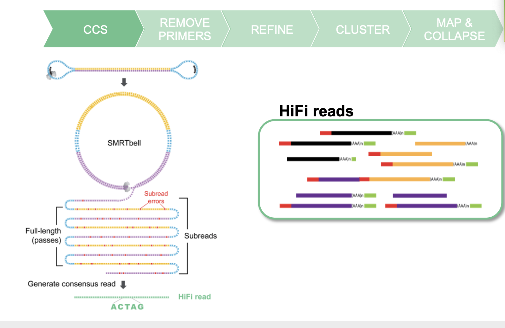

# Using the Iso-Seq Application on SMRTlink and BioConda

Elizabeth Tseng, Principal Scientist, PacBio

## Why use Iso-Seq analysis?

ISO-SEQ ANALYSIS MAIN FEATURES
* No reference genome required
* No transcriptome assembly required
* Recovers full-length (5’ to 3’) transcripts - Yields highly accurate (>99%) transcripts

HIFI READS FROM CCS

