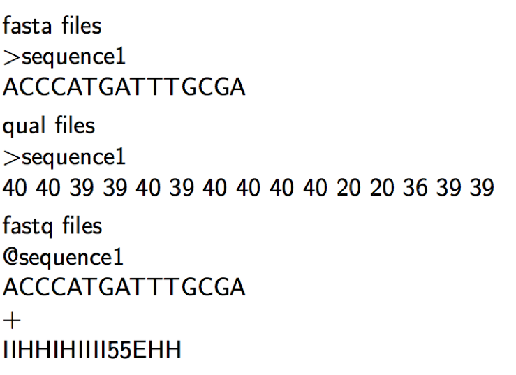
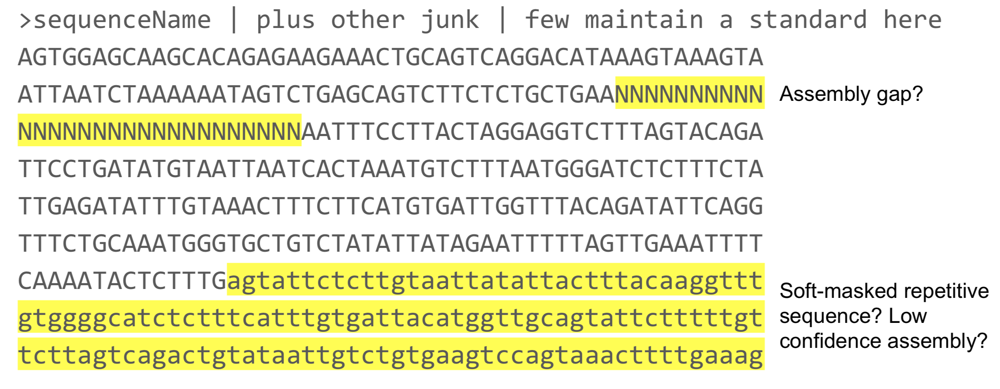
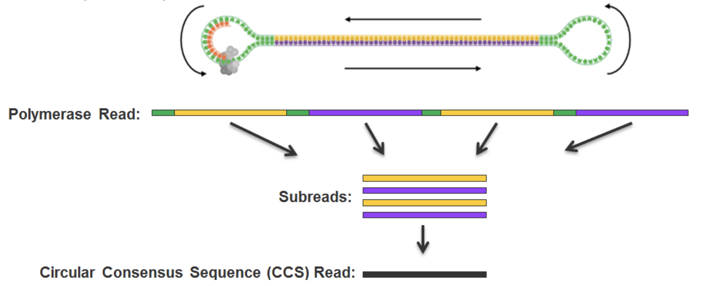
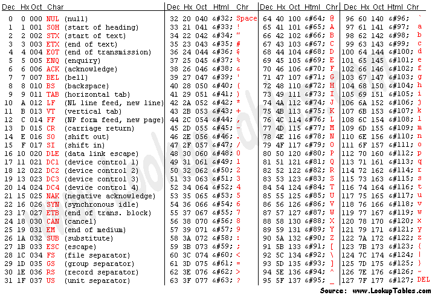
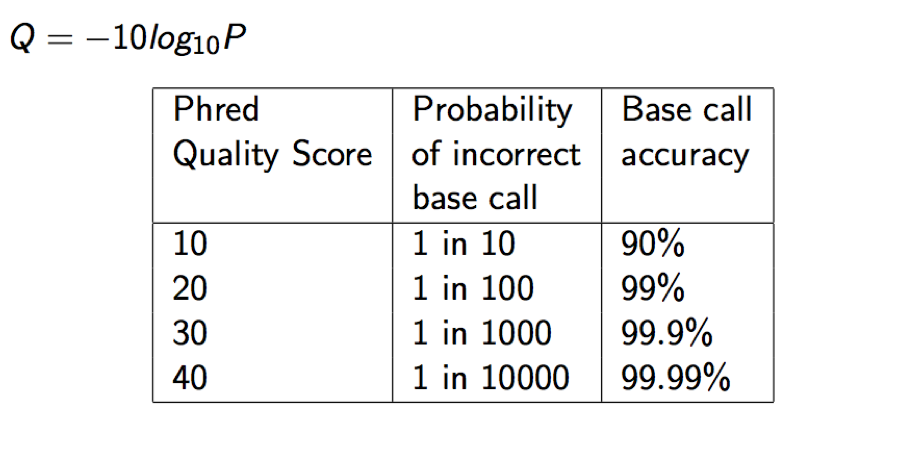
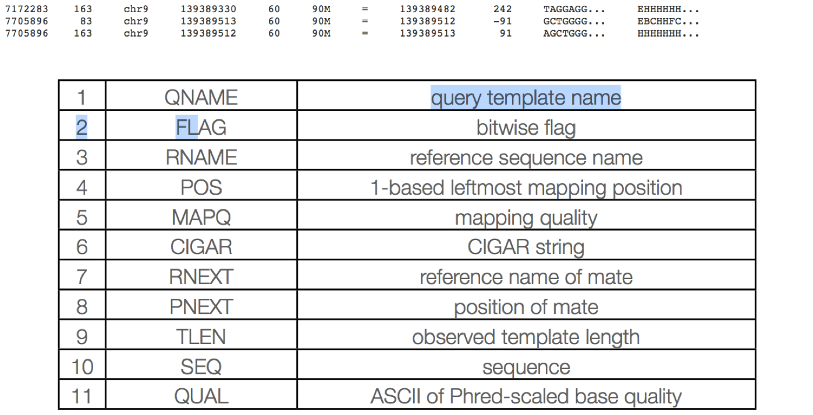

# Files and File Types

The primary file types you'll see related to PacBio sequence analysis are:

* [fasta](#fasta)
* [fastq](#fastq) maybe
* [sam/bam](#Alignment-based-file-types)

## Sequence based file types

Sequence based files first started out as fasta with paired qual files (Sanger and 454), with Illumina and quality scores, the fastq file became the common default output from DNA sequencers. These days additional file types are being used, including fast5 by Oxford Nanopore and 'unmapped' bam files by Pacific Biosciences.

### fasta
The fasta format uses the '>' to indicate a new sequence followed by the name of the sequence on the same line. The following line(s) are the DNA sequence and may be split on multiple lines (wrapped), until the next '>' is reached. Genome and transcriptome files are most often in fasta format.

Qual files are so rarely used these days and so are not discussed.

### fastq
fastq files combine the sequence and quality scores into 1 file. Each sequence here has 4 lines (should be enforced strictly), header, sequence, historical '+', and quality.

PacBio raw read ids have the format

{movieName}/{holeNumber}/{qStart}_{qEnd}

m64069_200619_021350/10/0_358
* m64069_200619_021350: should be unique
* 10: Hole number or ZMW
* 0_358: start and stop location of the fragment in the molecule, these are 0-based half-open (end inclusive coordinates)

For CCS Reads the read id becomes
{movieName}/{holeNumber}/ccs

### Quality Scores
Quality scores are paired 1 to 1 with sequence characters.

Each quality character has a numerical value associated with it (ASCII value). In Illumina 1.8+ and PacBio you subtract 33 from the ascii value associated with the quality character to get the quality score.

Ascii code table

Quality scores table

## Alignment based file types

### SAM/BAM

The project managing the specifications and common software is http://www.htslib.org/.

SAM (Sequence Alignment/Map) format is the unified format for storing read alignments to a reference sequence (consistent since Sept. 2011).
http://samtools.github.io/hts-specs/SAMv1.pdf
http://samtools.github.io/hts-specs/SAMtags.pdf

BAM  are compressed SAMs (binary, not human-readable). They can be indexed to allow rapid extraction of information, so alignment viewers do not need to uncompress the whole BAM file in order to look at information for a particular coordinate range, somewhere in the file.

Indexing your BAM file, mybam.bam, will create an index file, mybam.bam.bai, which is needed (in addition to the BAM file) by viewers and some downstream tools.

**The SAM format contain two regions:**

The header section -
Each header line begins with character ’@’ followed by a two-letter record type code.

The alignment section -
Each alignment line has 11 mandatory fields. These fields always appear in the same order and must be present, but their values can be '0' or '*', if the corresponding information if unavailable, or not applicable.

#### Header section

Each header line begins with the character ‘@’ followed by one of the two-letter header record type codes. In the header, each line is TAB-delimited and, apart from @CO lines, each data field
follows a format ‘TAG:VALUE’ where TAG is a two-character string that defines the format and content of
VALUE.   

The following tags are required in an _aligned_ bam file:

* @HD The header line. The first line if present.
  * VN* Format version. Accepted format: /^[0-9]+\.[0-9]+$/.
* @SQ Reference sequence dictionary. The order of @SQ lines defines the alignment sorting order.
  * SN* Reference sequence name. The SN tags and all individual AN names in all @SQ lines must be distinct. The value of this field is used in the alignment records in RNAME and RNEXT fields. Regular expression: [:rname:∧ *=][:rname:]*
  * LN* Reference sequence length. Range: [1, 2
  31 − 1]
* @RG Read group. Unordered multiple @RG lines are allowed.
  * ID* Read group identifier. Each @RG line must have a unique ID. The value of ID is used in the RG tags of alignment records. Must be unique among all read groups in header section. Read group IDs may be modified when merging SAM files in order to handle collisions.

in an _unaligned_ bam file like PacBio uses for raw data the @SQ Tags are not available.

Many more tags are detailed in the specifications.

#### Alignment section

The alignment section consists of 11 tab delimited fields.

**QNAME: Query name**  
Read IDs are truncated at first whitespace (spaces / tabs), which can make them non-unique.

**FLAG: Alignment flags**

Tool to help explain flags

https://broadinstitute.github.io/picard/explain-flags.html

**RNAME: reference sequence name**  
Reference sequence ID (from fasta header) matches a @SQ field in the header section.

**POS: 1-based leftmost position of (post-clipping) aligned read**  

**MAPQ: mapping quality (phred scaled)**  
MAPQ, contains the "phred-scaled posterior probability that the mapping position" is wrong.   
In a probabilistic view, each read alignment is an estimate of the true alignment and is therefore also a random variable. It can be wrong. The error probability is scaled in the Phred. For example, given 1000 read alignments with mapping quality being 30, one of them will be incorrectly mapped to the wrong location on average.  
A value 255 indicates that the mapping quality is not available.

###### MAPQ explained
The calculation of mapping qualities is simple, but this simple calculation considers many of the factors below:
* The repeat structure of the reference. Reads falling in repetitive regions usually get very low mapping quality.
* The base quality of the read. Low quality means the observed read sequence is possibly wrong, and wrong sequence may lead to a wrong alignment.
* The sensitivity of the alignment algorithm. The true hit is more likely to be missed by an algorithm with low sensitivity, which also causes mapping errors.
* Paired end or not. Reads mapped in proper pairs are more likely to be correct.

When you see a read alignment with a mapping quality of 30 or greater, it usually implies:
* The overall base quality of the read is good.
* The best alignment has few mismatches.
* The read has just one ‘good’ hit on the reference, which means the current alignment is still the best even if one or two bases are actually mutations, or sequencing errors.

_**In practice however, each mapping application seems to compute the MAPQ in their own way.**_

**CIGAR: Compact Idiosyncratic Gapped Alignment Report (CIGAR)**  
The CIGAR string is used to calculate how a sequence aligns to the reference. Format: [0-9][MIDNSHP][0-9][MIDNSHP]... where M = match, I/D = insertion / deletion, N = skipped bases on reference (splicing), S/H = soft / hard clip (hard clipped bases no longer appear in the sequence field), P = padding.

e.g. “100M” means that all 100 bases in the read align to bases in the reference.

* “Consumes query” and “consumes reference” indicate whether the CIGAR operation causes the alignment to step along the query sequence and the reference sequence respectively.
* H can only be present as the first and/or last operation.
* S may only have H operations between them and the ends of the CIGAR string.
* For mRNA-to-genome alignment, an N operation represents an intron. For other types of alignments, the interpretation of N is not defined.
* Sum of lengths of the M/I/S/=/X operations shall equal the length of SEQ.

**RNEXT: reference sequence name of the primary alignment of the next read in the template.**  
For the last read, the next read is the first read in the template. If @SQ header lines are present, RNEXT (if not ‘*’ or ‘=’) must be present in one of the SQ-SN tag. This field is set as ‘*’ when the information is unavailable, and set as ‘=’ if RNEXT is identical RNAME. If not ‘=’ and the next read in the template has one primary mapping (see also bit 0x100 in FLAG), this field is identical to RNAME at the primary line of the next read. If RNEXT is ‘*’, no assumptions can be made on PNEXT and bit 0x20.

**PNEXT: 1-based position of the primary alignment of the next read in the template.**  
This field equals POS at the primary alignment of the next read. If PNEXT is 0, no assumptions can be made on RNEXT and bit 0x20. Set as 0 when the information is unavailable.

**TLEN: The signed observed Template length.**  
If all segments are mapped to the same reference, the unsigned observed template length equals the number of bases from the leftmost mapped base to the rightmost mapped base. The leftmost segment has a plus sign and the rightmost has a minus sign. The sign of segments in the middle is undefined. It is set as 0 for single-segment template or when the information is unavailable.

**SEQ: segment sequence**  
The sequence that was aligned. If hard clipping occurred, only the aligned portion is represented, if soft clipping occurred, the original sequence is present.

**QUAL: segment quality scores**  
The quality scores of the sequence that was aligned. If hard clipping occurred, only the aligned portion is represented, if soft clipping occurred, the original sequence is present.

### The _Unaligned_ Bam file for PacBio

In an _unaligned_ bam, the fields below are all set to the following:

* FLAG: 4 (unaligned)
* RNAME: *
* POS: 0
* MAPQ: 255 (high quality don't filter)
* CIGAR: *
* RNEXT: *
* PNEXT: 0
* TLEN: 0

In the CIGAR string, the “M” CIGAR op is forbidden in PacBio BAM files. PacBio BAM files use the more explicit ops “X” (mismatch) and “=” (match). PacBio software will abort if the "M" is found in a CIGAR field.

| Data type	| Filename template |
| :-----| :-----|
|ZMW reads from movie |	movieName.zmws.bam |
|Analysis-ready subreads 1 from movie | movieName.subreads.bam |
| Excised adapters, barcodes, and rejected subreads | movieName.scraps.bam |
| CCS reads computed from movie | movieName.ccs.bam |
| Aligned subreads in a job | jobID.aligned_subreads.bam |
|Aligned CCS in a job |	jobID.aligned_ccs.bam |

Pacific Biosciences uses the _unaligned_ bam file in order to add additional information to each scrap/subread/ccs reads. Examples include

* np: NumPasses (1 for subreads, variable for CCS—encodes number of complete passes of the insert)
* ip: IPD (raw frames or codec V1)
* pw: PulseWidth (raw frames or codec V1)

See the [PacBio BAM Specification](https://pacbiofileformats.readthedocs.io/en/9.0/BAM.html) for a full and current listing.
