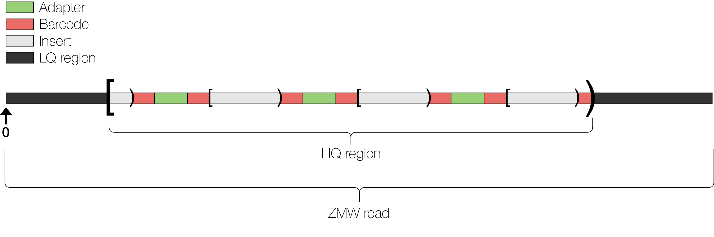

# PacBio Data

What might you expect to receive from a PacBio Sequencing Provider?

For Isoseq data, you could receive raw bam files, ccs result, OR isoseq pipeline within smrtlink results.

We would recommend you start from the CCS files. The SMRTlink isoseq run is ok if you don't have compute or are new to Bioinformatics (lack of ability), however doing the isoseq analysis pipeline yourself provides you with greater control over the output.

## PacBio Subread and Scraps



PacBio processes each ZMW's original full polymerase read on the Sequel II for adapters and optionally barcodes producing a scraps (low quality regions, adapter sequence and barcode sequence) and subreads (the insert). These data are now represented within a _unaligned_ bam file. See [File Types](./filetypes)


##  Creating a Project Directory

First, create a directory for you and the example project in the workshop share directory:

```bash
cd
mkdir -p /share/workshop/isoseq_workshop/$USER/view_data
```

## Link raw data files

1. Next, go into that directory, lets then create symbolic link to the data directories that contains the raw and secondary processed data.

    ```bash
    cd /share/workshop/isoseq_workshop/$USER/view_data
    ln -s /share/workshop/PacBio_data/* .
    ```

    This directory now contains a folder of a single smrt cell's isoseq data. **NOTE: This is the structure (partially) that the UC Davis Sequencing Core uses and may not be the structure you get back from your provider**

## Getting To Know the Data a little

1. Now, take a look at the raw data directory. The structure here is a PacBio "Run", followed by the Cell index (here C1) and then data folders underneath.

    The data folders are:

    1. 3_C01_Primary, This is the primary output
    2. 0000001653, secondary analysis folder for the isoseq pipeline
    3. 01-ccs, this is the ccs output, not by smrtline but rather by the command line.


2. Lets tale a look at the primary output

    ```bash
    ls -lah /share/workshop/isoseq_workshop/$USER/view_data/r64069_20200616_170349/C1/3_C01_Primary
    ```

    There are a number of files in this directory, but the most relevant are the scraps.bam and the subreads.bam files.

    Lets take a quick look at those files.

    ```bash
    module load samtools
    cd /share/workshop/isoseq_workshop/$USER/view_data/r64069_20200616_170349/C1/3_C01_Primary
    samtools view m64069_200619_021350.scraps.bam | head -n 1
    samtools view m64069_200619_021350.subreads.bam | head -n 1
    ```

    **Questions**
    1. in the scraps file
        1. what is the ZMW of the first fragment in the file?
        2. what are the fragment coordinates from the polymerase read? and so what is the length of fragment, verify this by looking at the sequence.
        3. What kind of "Scrap region-type annotation" is this fragment? Use the [bam reference to help](https://pacbiofileformats.readthedocs.io/en/9.0/BAM.html)
    2. in the subreads file
        1. what is the ZMW of the first fragment in the file? Why would it be different from the scraps file?
        2. what are the fragment coordinates from the polymerase read? and so what is the length of fragment, verify this by looking at the sequence.
        3. What are the quality scores assigned to each base?
        4. what is the pw tag? Other tags?

3. Lets tale a look at the ccs output

    The current implementation of the CCS algorithm is described [here](https://ccs.how/)

    ```bash
    ls -lah /share/workshop/isoseq_workshop/$USER/view_data/r64069_20200616_170349/C1/01-ccs
    ```

    There are a number of files in this directory, but the most relevant is the ccs.bam.

    Lets take a quick look at those files.

    ```bash
    module load samtools
    cd /share/workshop/isoseq_workshop/$USER/view_data/r64069_20200616_170349/C1/01-ccs
    samtools view m64069_200619_021350.ccs.bam | head -n 1
    ```

    **Questions**
    1. what is the ZMW of the first fragment in the file? Is it the same as the subread?
    2. how many subreads contributed to this CCS read?
    3. what are some of the quality scores assigned to each base, what seems to be the range? For those with experience with Illumina, how does this compare.
    4. what is the rq tag?

4. The secondary output folder

    ```bash
    ls -lah /share/workshop/isoseq_workshop/$USER/view_data/r64069_20200616_170349/C1/0000001653
    ```


    ```bash
    ls -lah /share/workshop/isoseq_workshop/$USER/view_data/r64069_20200616_170349/C1/0000001653/outputs
    ```

    There are a number of files in this directory, but since the whole point of this workshop is to perform these, we won't go into them.

## Homework, command line practice

1. for the ZMW m64069_200619_021350/50 how many subreads contributed to the consensus reads?
2. how many subreads does this fragment have in the primary subreads file? **Warning: takes a long time to run, its a BIG file** OR you can cheat
    ```
    samtools view  m64069_200619_021350.subreads.bam | head -n 100000 | grep -c  '^m64069_200619_021350/50/'
    ```

3. take your time to look through the directories and files. Which are summaries.
**Advanced**
4. how many "reads" are in our subreads file, so total unique zmw?
5. what is the average length of the subreads?
